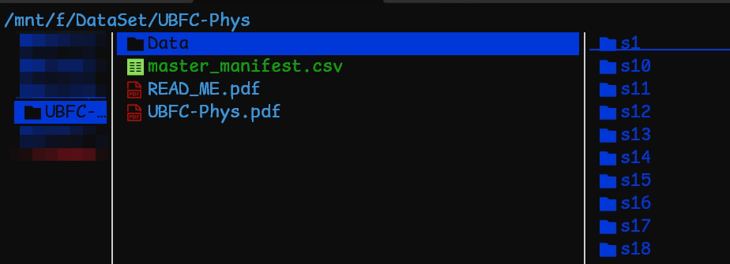

# CCT-LSTM_reproduce

## integrity_and_masterManifest.py 
### Check the integrity of UBFC-Phys dataset by the following logic:
1. In selected folder, if "UBFC-Phys" folder exists, then it will be used as the dataset.
2. In "UBFC-Phys", if "Data" folder exists.
3. If there are 56 folders named "s1(subject number)", "s2", ..., "s56" in "Data" folder.
4. For each subject folder:
   1. if there are 3 avi files named "vid_s1(subject number)_1.avi", "vid_s1_2.avi", "vid_s1_3.avi".
   2. if there are 3 csv files named "bvp_s1(subject number)_T1.csv", "bvp_s1_T2.csv", "bvp_s1_T3.csv".
   3. if there are 3 csv files named "eda_s1(subject number)_T1.csv", "eda_s1_T2.csv", "eda_s1_T3.csv".
   4. if there is 1 txt file named "info_s1(subject number).txt".
   5. if there is 1 csv file named "selfReportedAnx_s1(subject number).csv".
If any of the above conditions are not met, it will print an error message and exit.

### To be noticed, after running integrity check ourselfs we found the Problem below:
we download the dataset from:  
dat@UBF https://search-data.ubfc.fr/FR-18008901306731-2022-05-05_UBFC-Phys-A-Multimodal-Dataset-For.html 
- Error: In folder 's40' file 'vid_s40_T3.avi' not found.  
Whcih is just a name error, you can check it by yourself.
- Error: In folder 's56' file 'selfReportedAnx_s56.csv' not found.  
The self report in folder s55 & s56 have the same value, which might be a dataset error, but we don't need the Anx_Report in our project, so we ignore it.
### After integrity check, it will generate a master manifest file named "masterManifest.csv" in the selected folder.
The master manifest file will contain the following columns:
- subject: subject number
- group: 'test' or 'ctrl'

## file_path_gen.py
### Generate the file paths for the UBFC-Phys dataset.
The path will be based on "UBFC_data_path.txt" generated by "integrity_and_masterManifest.py" in the project root directory.  
The dataset is organized as the following structure:  

### xxx(parent folder)/UBFC-Phys/Data/s1(subject folder)/vid_s1_1.avi etc.